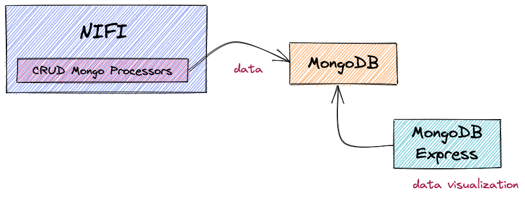

# Integration with MongoDB

NiFi provides processors for interacting with nosql databases like mongdb such as GetMongo, PutMongo, DeleteMongo etc.



### Stack overview

* NiFi
* MongoDB
* MongoDB Express

## Prerequisites
* Install [Docker](https://www.docker.com/)
* Install [Docker Compose](https://docs.docker.com/compose/install/)

## Deploy ecosystem stack

Step 1: Clone the repository and checkout usecase

```shell
$ > git clone https://github.com/naddym/nifi-course.git
$ > cd integrating-with-nosql/mongodb
```

Step 2: Deploy stack with docker-compose

```shell
$ > sudo docker-compose up
```

## Navigating to the instances

NiFi - https://localhost:8080/nifi

MongDB Express - https://localhost:8081

